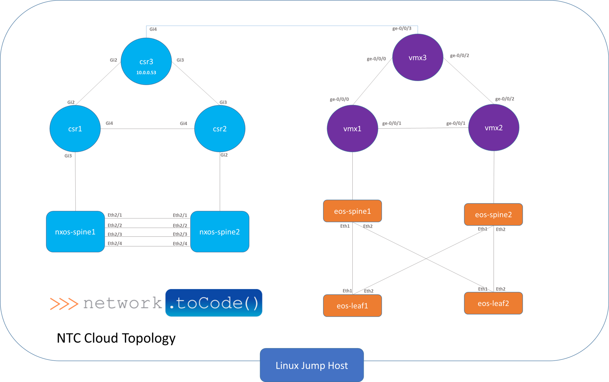

# Lab 1 - Accessing the Lab Environment

### Task 1 - Understand the Lab Topology

You will primarily access the Linux jump host for all labs in the course.




### Task 2 - Accessing the Lab Environment

Obtain your pod number from the Course Instructor:

*  The pod will map directly to a publicly available FQDN that will be the public IP of your Linux jump host.
*  You will be able to access all network devices by name through this jump host when the network labs start.

The FQDN will be as follows:

```
pod<pod-number>.cloud.networktocode.com
```

Username: **ntc**
Password: **Ask the Instructor**

You can access the Jump Host via SSH or RDP (for a full desktop experience)

Using a Linux based OS, use the following command:

```
ssh ntc@pod<pod-number>.cloud.networktocode.com
```

Otherwise, you can use a standard SSH client such as Putty or SecureCRT.


