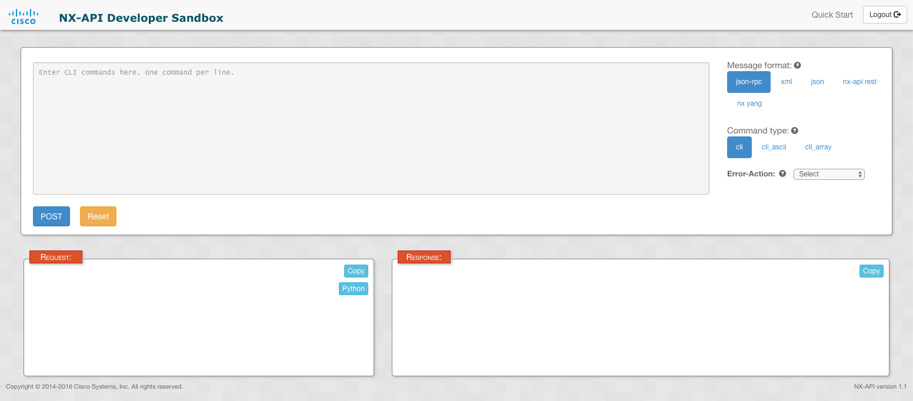
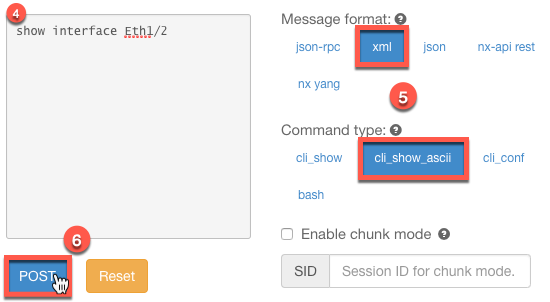
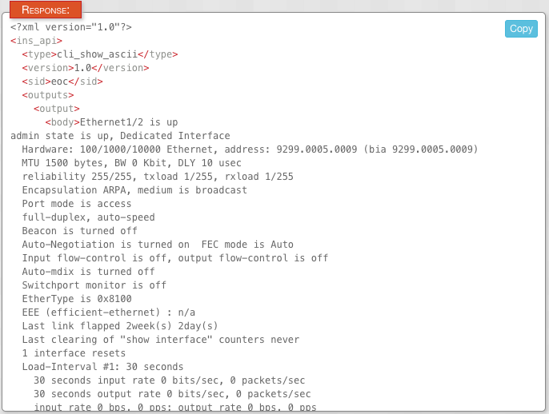
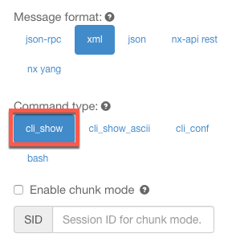
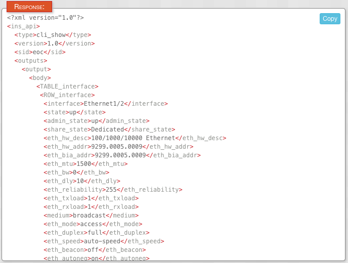
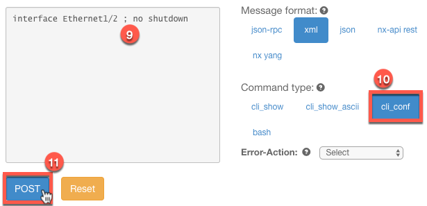
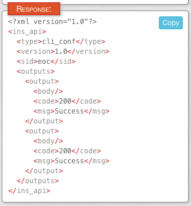

# Lab 20.2 - Cisco NX-API

### Task 1 - NX-API Developer Sandbox

This task introduces you to the Developer Sandbox environment that exists on each Nexus switch (assuming it supports NX-API).  The NX-API is a great tool for beginners and experts alike, as it gives you direct insight with how the switch will respond to API calls.  This allows you to verify what key-value pairs and responses you should be getting back as you are writing and testing your code.

##### Step 1

> Note: The below tasks must be performed from an RDP session to your lab jump host.  

Open a Web Browser and connect to the switch using `https://nxos-spine1`

Remote-desktop into your jump-host and open a web browser and connect to the switch using `https://nxos-spine1`

Ensure you are using **https**.

Login with the credentials `username: ntc, password: ntc123`


You will then see the NX-API Developer Sandbox:



##### Step 2

Enter the command `show version` in the large text box on the left hand side. Keep all other settings as default for now.

##### Step 3

Click the **Send** button.

You will see the response in the **Response** box.


Notice the JSON data that came back. It has several key-value pairs including `jsonrpc` and `result`.  Notably, the main response is in under its own key called `body` as the value for the key `result`.

##### Step 4

In the command text box, now enter the following command:

`show interface Eth1/2`

##### Step 5

Choose the Message format **XML** and choose the command type **cli_show_ascii**

>> Note: **cli_show_ascii** is used when you want to receive raw text back from the device as opposed to structured data that is returned when you use **cli_show**.

##### Step 6

Click the amber **Send** button.



You will see the raw text response just like you'd see if you were on the switch locally.



##### Step 7

Now keep the same command `show interface Eth1/2`, but change the command type back to **cli_show**.



##### Step 8

Click the amber **Send** button.

Notice the difference from the previous task comparing and contrasting receiving structured data (XML) vs. raw text.  Feel free to try the same command using JSON-RPC.



##### Step 9

Now Go back to the command text box and enter the following string:

```
interface Ethernet1/2 ; no shutdown
```

##### Step 10

Change the command type to be **cli_conf**.

**cli_conf** is used when you want to configure the device from within "configuration" mode on the switch.


##### Step 11

Click the amber **Send** button.



You will see the response in the bottom left.  Notice that a status code for each command returned.




Take a few more minutes and continue to explore the Cisco NX-API Developer Sandbox.
